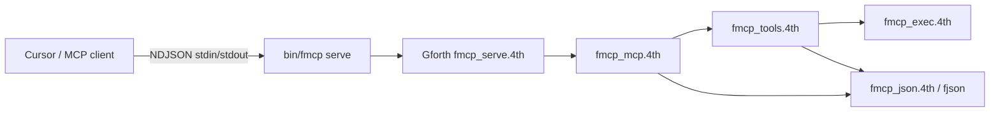

# fmcp API and architecture

MCP stdio bridge for VitaSound Forth tools. Console utility (Gforth);
`bin/fmcp serve` runs one long-lived Gforth process; protocol logic lives in Forth.

## Architecture



1. **`bin/fmcp serve`** starts Gforth with `$FMCP_HOME` on fpath, `require fmcp_serve.4th`,
   then **`fmcp.serve-stdio`** (readline loop on stdin).
2. Each line is parsed with `fjson.parse` (tree); `method` / `id` / `params` read via
   `fjson.object-get`, tools dispatched.
3. Response built in `fmcp_build.4th` as an fjson node tree, serialized with
   `fjson.emit-node` via `fmcp.emit-node-line` (stdout NDJSON).

**Legacy/alternate:** `fmcp_serve_line.4th` / `fmcp_line.4th` handle one request from
`FMCP_LINE` env (useful for debugging; not used by `bin/fmcp serve` today).

---

## CLI

| Command | Description |
|---------|-------------|
| `fmcp help` | Usage text. |
| `fmcp version` | Version from `package.4th`. |
| `fmcp serve` | MCP server (stdio NDJSON). |

Environment (for tools):

| Variable | Purpose |
|----------|---------|
| `FMCP_HOME` | Path to fmcp checkout (set by `bin/fmcp`). |
| `FMIX_HOME` | Path to fmix checkout (for `fmix test`, `packages.get`). |
| `FLINT_HOME` | flint binary home. |
| `FCOV_HOME` | fcov binary home. |
| `FMCP_LINE` | Optional: one JSON-RPC line for `fmcp_serve_line.4th` / `fmcp_line.4th` (legacy). |

---

## MCP methods

| Method | Handler | Response |
|--------|---------|----------|
| `initialize` | Fixed JSON | `protocolVersion` 2025-11-25, `serverInfo` fmcp 0.1.4 |
| `notifications/initialized` | no-op | (no reply) |
| `tools/list` | `fmcp.tools-list-node` | Tool schemas for all registered tools |
| `tools/call` | `fmcp.call-tool` | Tool result or error JSON |

Request id via `fmcp.mcp-id-str` (numeric or string `id` in parse tree).

---

## MCP tools

| Tool name | Forth | Required JSON params |
|-----------|-------|----------------------|
| `fmix_test` | `fmcp.fmix-test` | `project_root`, optional `test_file`, optional `timeout_seconds` (default 120, max 300) |
| `fmix_packages_get` | `fmcp.fmix-packages-get` | `project_root`, optional `timeout_seconds` (default 30, max 300) |
| `flint_lint` | `fmcp.flint-lint` | `project_root`, optional `timeout_seconds` (default 60, max 300) |
| `fcov_run` | `fmcp.fcov-run` | `project_root`, optional `test_command`, optional `timeout_seconds` (default 300, max 300) |
| `fcov_report` | `fmcp.fcov-report-json` | `project_root` |
| `gforth_eval` | `fmcp.gforth-eval` | `project_root`, `source`, optional `timeout_seconds` (default 10, max 300) |
| `mcp_ping` | `fmcp.mcp-ping-text` | _(none)_ |
| `shell_run` | `fmcp.shell-run` | `project_root`, `command`, optional `timeout_seconds` (default 10, max 300) |

`gforth_eval` appends ` bye`, writes `/tmp/fmcp-eval.4th`, runs `gforth /tmp/fmcp-eval.4th` in `project_root` via background capture (`fmcp.run-capture-bg`). Exit 124 → `fmcp timed out after N seconds` prefix and `isError: true`.

`shell_run` runs an arbitrary shell command in `project_root` with the same timeout/capture path as `gforth_eval`. The command is written verbatim to a temporary `/tmp/fmcp-cap-*.cmd` script (no user input embedded in `sh -c` quoting).

`fcov_run`, `fmix_test`, `flint_lint`, and `fmix_packages_get` use the same background capture path (`fmcp.run-capture-bg`): the serve loop polls the subprocess PID instead of blocking in `system`, so a timeout yields JSON `exit_code=124` and the MCP session stays alive for the next request.

`mcp_ping` returns `fmcp ok version … serve_pid …` for session health checks.

All tool results prepend a metadata line: `[fmcp] elapsed_ms=…  exit_code=…` (newline before tool output). Output is truncated at `FMCP_MAX_OUTPUT` (default 262144 bytes). Timeout (exit 124) adds `fmcp timed out after N seconds` to the body. Exit 125 means the subprocess died without writing an exit-code file (fail-fast poll, not a full timeout wait).

Unknown tool → JSON error with `"unknown tool"` in text content.

---

## Module map

| File | Responsibility |
|------|----------------|
| `fmcp.4th` | CLI dispatch, help, version, test. |
| `fmcp_mcp.4th` | JSON-RPC method routing. |
| `fmcp_tools.4th` | `tools/list` / `tools/call`, result JSON shape. |
| `fmcp_exec.4th` | Shell out to fmix/flint/fcov binaries; `run-capture-bg`, `gforth-eval`, `shell-run`. |
| `fmcp_poll.4th` | PID poll/kill for background subprocess timeout (exit 124); fail-fast exit 125 when PID is gone but `.ec` is empty. |
| `fmcp_shellfrags.4th` | Shell byte fragments (`>`, `;`, `--` safe in Gforth source). |
| `fmcp_json.4th` | fjson 0.2.3, `fmcp.line-parse`, `fmcp.parse-json`, emit. |
| `fmcp_utils.4th` | Paths, slurp, str helpers, `system-checked`. |
| `fmcp_build.4th` | JSON-RPC response tree builders. |
| `fmcp_serve.4th` | `fmcp.serve-stdio` — stdin readline MCP loop. |
| `fmcp_readline.4th` | Stdin line reading for `serve-stdio`. |
| `fmcp_serve_line.4th` | Legacy: `fmcp.serve-one-line` via `FMCP_LINE` env. |
| `fmcp_line.4th` | Legacy: single-line handler via `FMCP_LINE` env. |
| `fmcp_test.4th` | Unit test runner (`fmcp test`). |

### JSON helpers (`fmcp_json.4th`)

| Word | Stack | Notes |
|------|-------|-------|
| `fmcp.set-line` | `( la lu -- )` | Current MCP line buffer. |
| `fmcp.line-parse` | `( la lu -- ok )` | `fjson.parse` → `fmcp.parsed-root`. |
| `fmcp.parse-json` | `( la lu -- ok )` | `set-line` + parse from buffer. |
| `fmcp.line-free` | `( -- )` | Free `parsed-root`. |
| `fmcp.req-get` / `fmcp.req-str` | keys on parse tree | Inbound fields. |
| `fmcp.param-name` / `fmcp.arg-string` | `( -- )` / `( ka ku -- )` | `tools/call` params. |
| `fmcp.mcp-handle-line` | `( la lu -- )` | Full dispatch (tests). |
| `fmcp.mcp-handle-core` | `( -- )` | Dispatch after `set-line`. |
| `fmcp.emit-node-line` | `( node -- )` | stdout NDJSON + `node-free`. |
| `fmcp.sub?` | `( sa su -- f )` | Substring in current line. |

---

## Smoke E2E

**Smoke E2E** = minimal end-to-end check **without** a real MCP client or
Cursor:

```bash
bash tests/smoke_test.sh
```

The script pipes single NDJSON lines into `fmcp serve` and greps stdout:

1. `initialize` → response contains `protocolVersion`
2. `tools/list` → contains `fmix_test`
3. `tools/call` with unknown tool → contains `unknown`

This validates the stdio bridge and core protocol wiring. It does **not**
run `fmix test` against a real project or test Cursor `mcp.json` integration.

---

## Testing and quality

```bash
fmcp test                    # unit tests (*_test.4th)
bash tests/smoke_test.sh     # smoke E2E
fcov run && fcov report      # coverage (low until more in-process tests)
flint                        # dup words (expect noise from forth-packages/)
```

---

## Cursor setup

See [README.md](../README.md) for `mcp.json` example with `FMIX_HOME`,
`FLINT_HOME`, `FCOV_HOME`.

---

## Known gaps

- `fmcp.json-escape-text`: no `\"` escaping in tool results yet.
- fcov does not observe subprocess-only paths (`exec.4th`) during unit tests.
- fjson git dependency vendored until tag `0.1.0` is on GitHub; restore
  `key-list dependencies fjson git … tag 0.1.0` in `package.4th` after release.
